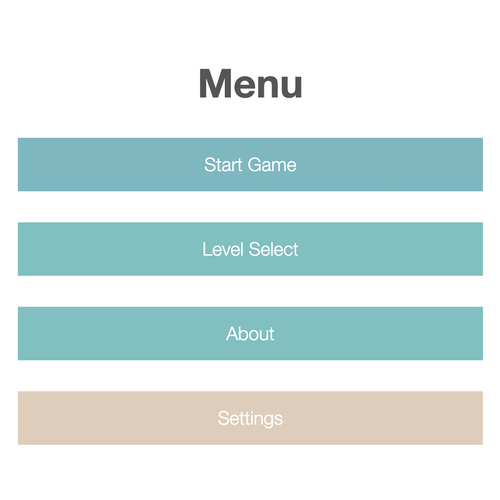

# MenuJS

An `ultra-light` framework for building straightforward menu pages. Ideal for `hackathons` and `prototypes`

# Demo

Check out the [live demo](https://regularmemory.blog/MenuJS/)!

# Basic Usage

Include `menu.js` in your app, call the class, and an awesome default menu will render! Clone this repo and get hacking

```html
<!-- Contents of index.html -->
<html>
    <head>
        <script src="menu.js"></script>
    </head>
<body>
    <script>
        new Menu();
    </script>
</body>
</html>
```

# Customization

Add a custom `container element`, a `script tag`, and pass a `config object` for more flexibility.

```html
<!-- Contents of index.html -->
<html>
    <head>
        <script src="menu.js"></script>
    </head>
<body>
    <div class="menu-container"></div>
    <script>
        let menu = new Menu({
            container: '.menu-container', // (optional: default container will be created)
            title: 'Example Title', // (optional: default title will be used)
            items: [
                "Start Game", // try an html-string!
                "Level Select",
                "About",
                "Settings"
            ]
        });
    </script>
</body>
</html>
```

# OnClick Callback

Add `callbacks` and `menu.js` will notify you when a menu item is clicked

```html
// Replace script in your index.html with the code below
<script>
    let menu = new Menu({
        container: '.menu-container',
        title: 'Example Title',
        items: [
            {
                name: "Start Game",
                onclick: (e) => {
                    console.log("Start Game was clicked");
                    console.log("Event ref:", e);
                }
            },
            "Level Select",
            "About",
            {
                name: "Settings",
                onclick: (e) => {
                    console.log("Settings was clicked");
                    console.log("Button ref:", e.target);
                }
            }
        ]
    });
</script>
```

The `items` array can be passed `strings`, as seen earlier, or the `objects` seen above, or a `combination` of both!

# Item Array Object Properties

The following properties can be added to `objects` passed to the `item array`:

| Property Name | Value | Description |
|-|-|-|
| name | string/html | Calls function when button is clicked |
| onclick | function | Calls function when button is clicked |
| color | Object | Specify base color and hover color {base: '#70B8C2', hover: '#0892A5'} |

# Config Object Properties

The following properties can be added to the `config object` passed to the `Menu class constructor`:

| Property Name | Value | Description |
|-|-|-|
| name | string/html | Calls function when button is clicked |
| container | string | the class selector for the menu container element. Element is created if it doesn't exist |
| title | string/html | The menu title |
| items | list | A list of strings and/or objects representing the menu items |
| style | boolean | If true, the menu will be styled. default: true |

# Screenshot

[](https://regularmemory.blog/MenuJS/)

# TODO

- [ ] onmouseover/onmouseout event properties to menu items
- [ ] Customizable background API
- [ ] Optional menu sound
- [ ] Optional buttons enlarge when hovered
- [ ] Optional buttons change color when highlighted
- [ ] Optional buttons puff out and sink when clicked

Created by: [Richard Hayes](https://richardhay.es/)
